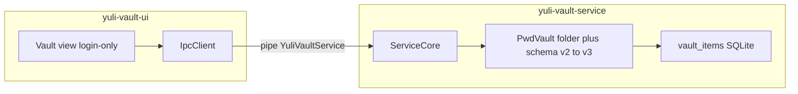

# Yuli Vault architecture

This document describes the dual-process layout, SDK layers, data flow, and key hierarchy. See [BUILD.md](BUILD.md) for how to compile, [IPC_PROTOCOL.md](IPC_PROTOCOL.md) for the pipe protocol, and [SECURITY.md](SECURITY.md) for the threat model.

## 1. Goals

Yuli Vault is a local-first vault:

- No cloud by default
- UI and crypto run in separate processes
- Engines (`ICryptoEngine`, `IStorageEngine`, `IPasswordGenerator`) are interfaces
- C++20, `core::Result<T>` instead of exceptions across IPC
- Binary IPC (little-endian, 16-byte header + payload)

## 2. Dual process

- **UI** (`yuli-vault-ui.exe`): Qt Widgets. Holds no encryption keys. English source strings; Simplified Chinese via `yuli-vault_zh_CN.qm`.
- **Service** (`yuli-vault-service.exe`): named pipe `\\.\pipe\YuliVaultService`, SQLite, AES-GCM, Argon2id.
- Data directory: `%APPDATA%\YuliVault\` (`vault.db`, `vault.meta`).

### Legacy PwdVault folder

`resolve_vault_data_dir` (`src/service/AppDataDir.h`):

1. Use `%APPDATA%\YuliVault\` if it exists.
2. Else copy `%APPDATA%\PwdVault\` into `YuliVault\` (keep the original) and write `migrated_from_pwdvault`.
3. Else create `YuliVault\`.

## 3. Item model

`VaultItem` (`src/sdk/core/Types.h`):

- Header (plaintext on disk): `id`, `type`, `title`, `tags`, timestamps
- Type payload: login fields (`account`, `username`, `password`, `website`, `note`) encoded by `encode_item_payload`
- `VaultItemType`: Login (1), SecureNote (2), Card (3), Identity (4), Custom (5)
- `PasswordEntry` is a compatibility alias of `VaultItem`

This release only edits Login items. Unknown or non-login types still list with a type badge; opening them asks the user to upgrade.

## 4. Schema v3

`settings.schema_version = 3`. Table `vault_items`:

| Column | Notes |
| --- | --- |
| `type` | `VaultItemType` |
| `title` | plaintext |
| `payload` | encoded type fields; ciphertext when a program password is on |
| `iv` / `tag` | AES-GCM; empty in plaintext mode |
| timestamps | unix seconds |

`entry_tags` points at `vault_items`. `tags`, `generated_passwords`, and `settings` stay.

**v2 → v3** (`passwords` table, password-only ciphertext, other columns plaintext):

- No `vault.meta`: migrate immediately on service start
- With `vault.meta`: keep v2 while locked; after a successful Unlock, re-encrypt payloads in one pass and drop `passwords`
- Do not DROP/recreate in a way that discards user rows

## 5. Encryption

When a program password is enabled, ServiceCore encrypts the **entire payload blob**, not only the password. Title, type, and tags remain searchable without the key. Account, username, website, and notes are filtered in memory after decrypt.

`vault.meta` still stores salt + Argon2id-wrapped `encryption_key` (KEK). Magic bytes of `vault.meta` are unchanged so copied PwdVault files open.

IPC protocol **version is 2** (VaultItem gained a type byte). UI and service ship together.

## 6. SDK layout

| Library | Target alias | Role |
| --- | --- | --- |
| `yuli-vault-sdk-core` | `YuliVault::SdkCore` | header-only types |
| `yuli-vault-crypto` | `YuliVault::Crypto` | AES-GCM + Argon2id |
| `yuli-vault-storage` | `YuliVault::Storage` | SQLite + in-memory |
| `yuli-vault-generator` | `YuliVault::Generator` | generator |
| `yuli-vault-protocol` | `YuliVault::Protocol` | IPC |
| aggregate | `YuliVault::Sdk` | all of the above |

## 7. Extending

- New IPC commands: follow the checklist in [AGENTS.md](../AGENTS.md)
- New item editors: keep `VaultItemType`, add UI later; do not change schema for Login-only work
- Do not modify `legacy-python/`
